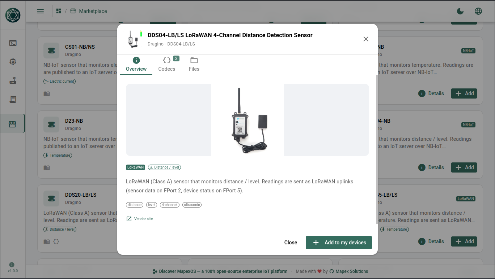
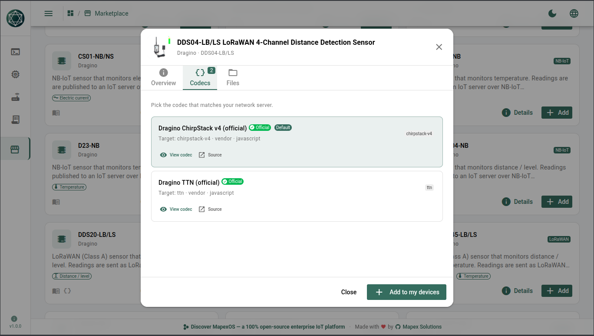
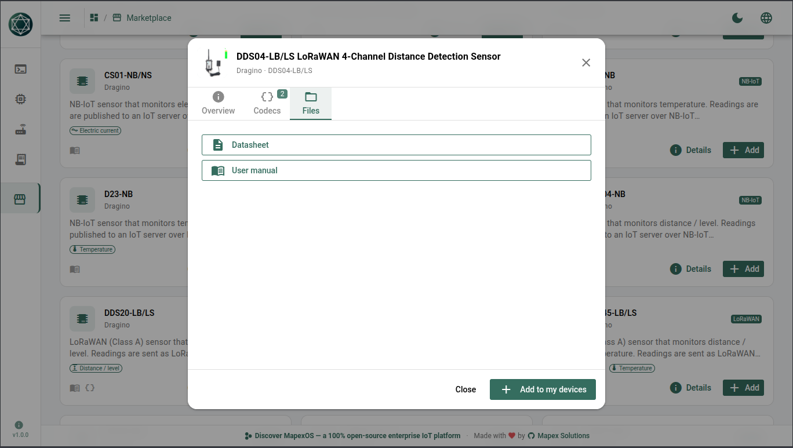
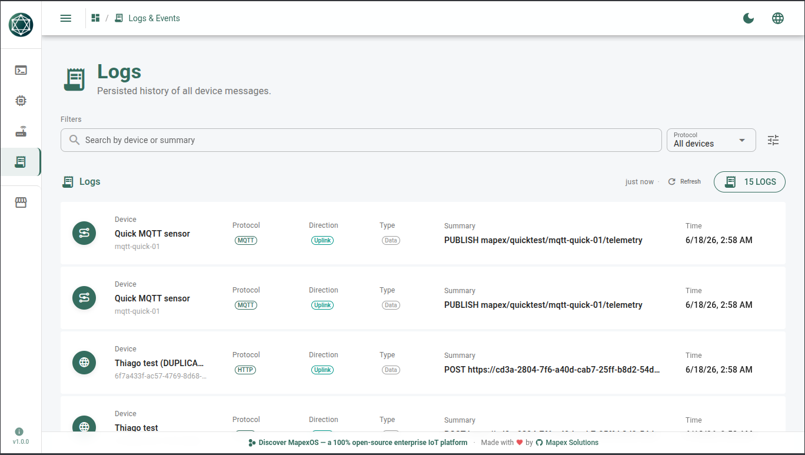

# Mapex Marketplace

> One catalog of real IoT devices — datasheet, manual, payload codec and a
> ready-to-run simulator profile — so any MapexOS project can browse, install and
> simulate a device **without buying the hardware**.

## Why we built it

Building and testing an IoT platform usually starts with a purchase order. You
want to see how your stack behaves with a Dragino soil probe, a Milesight people
counter, an NB-IoT pressure sensor — so you buy one, wait for shipping, flash the
keys, stand up a gateway, and then go hunting across vendor wikis for the
datasheet, the user manual, and the payload decoder that actually matches your
network server. Multiply that by every model you want to support and "let's try
this device" turns into weeks and a budget line. Worse, vendor doc links rot: the
manual you bookmarked is a 404 a year later.

We wanted the opposite. Open a catalog, pick a device, and have it behave like the
real thing in seconds — emitting payloads with the **real byte layout its official
codec expects** — with its datasheet, manual and decoder sitting right next to it,
captured and version-pinned so they never disappear.

That is the Mapex Marketplace: a single, stateless catalog service that turns
"buy hardware to test" into "browse and simulate."

## What you get, per device

- **Information sheet** — model, protocol (LoRaWAN / NB-IoT / …), reading types,
  vendor, and a localized (en-US / pt-BR) description.
- **Simulator profile** — a ready-to-install device definition whose events emit
  payloads with the real structure, **validated against the vendor's official
  decoder**, so what you simulate is what a real node would send.
- **Codecs** — the official payload decoders (TTN + ChirpStack) shipped with the
  device, so you can wire them straight into your network server.
- **Docs** — datasheet and user manual as **local PDFs** (plus the original online
  link), so the catalog survives the vendor's site going down.

## Used across MapexOS

The marketplace is shared infrastructure for the MapexOS ecosystem — one catalog,
many consumers:

- **[Mapex Devices Simulator](https://github.com/Mapex-Solutions/mapexDevicesSimulator)**
  — browse this catalog, install a device, and simulate real data and payloads over
  HTTP / MQTT / LoRaWAN without owning a single sensor; the datasheet, manual and
  codec are one click away.
- **[MapexOS](https://github.com/Mapex-Solutions/mapexOS)** — the open-source
  enterprise IoT platform those devices ultimately run on.
- It is built to host **every** MapexOS marketplace from the same primitive:
  workflow plugins, devices today, asset templates next.

## See it in action

A few screenshots of the [Mapex Devices Simulator](https://github.com/Mapex-Solutions/mapexDevicesSimulator)
consuming this catalog — full set under [`images/`](images).

**Browse the catalog** — filter by protocol, reading type or manufacturer.


**Device detail** — overview with description, reading-type tags and the vendor link.


**Codecs** — the official ChirpStack v4 and TTN decoders shipped with the device.


**Files** — datasheet and user manual, one click away.


**Installed device** — configure its events and an auto-repeat schedule.


**Console** — fire events and watch live HTTP / MQTT / LoRaWAN messages with real payloads.


**Logs & Events** — the persisted history of every message.


## How it works

A single Go service hosts every marketplace. There is **no Mongo, Redis, or NATS**.
The JSON catalog under `catalog/` is the source of truth; on boot the service reads
one lightweight manifest per vendor and builds an in-process **SQLite search
index**. Heavy bundles (information sheets, install templates, codecs, images) are
read lazily from disk only when requested, so the service scales to large catalogs
with a small, constant startup cost.

## Architecture

Go + Fiber, DDD + Hexagonal per the Mapex `/go-arch` standard. Each marketplace is
a thin module over the same catalog primitive:

```
src/
  main.go
  bootstrap/        config · fiber · health · catalog (SQLite index) · shutdown
  shared/configuration
  modules/
    app/            module init loop (repositories → services → interfaces)
    devices/        domain · application · infrastructure/catalog · interfaces/http
packages/contracts/ wire DTOs (TS schema counterpart mirrors these)
catalog/            the JSON source of truth
  devices/
    catalog_config.json
    vendors/{vendor}/catalog.json          # read at boot → index
    vendors/{vendor}/{model}/              # bundles, served lazily
```

## Devices API

Base path `/api/v1/devices`:

| Method | Path | Purpose |
|--------|------|---------|
| GET | `/` | List + filter (`protocol`, `readingType`, `manufacturer`, `search`, `lang`, `page`, `perPage`) |
| GET | `/facets` | Available filter options |
| POST | `/refresh` | Rebuild the index from disk |
| GET | `/:vendor/:slug` | Model information sheet |
| GET | `/:vendor/:slug/simulator` | Model install template |
| GET | `/:vendor/:slug/assets/*` | Bundle asset (codec, manual, image) |

`GET /health` is the liveness probe. All JSON responses use the standard
`{ status, errors, data }` envelope. Card text is localized server-side via the
`lang` query (e.g. `?lang=pt-BR`); the information sheet carries every locale and
the client picks one.

## Run locally

```bash
go build -o bin/marketplace ./src
./bin/marketplace            # serves http://127.0.0.1:6060, reads ./catalog
```

Configuration is via env vars (see `src/shared/configuration/application/config.go`):
`HTTP_PORT` (6060), `CATALOG_DIR` (`./catalog`), `CATALOG_INDEX_PATH`
(`./data/catalog-index.db`), `CORS_ORIGINS` (`*`).

## Dependencies

`mapexGoKit` is consumed from the sibling checkout via `replace` directives
(`../mapexGoKit/*`), matching the other Mapex Go services.

---

🇧🇷 Versão em português: [README_pt.md](README_pt.md)
